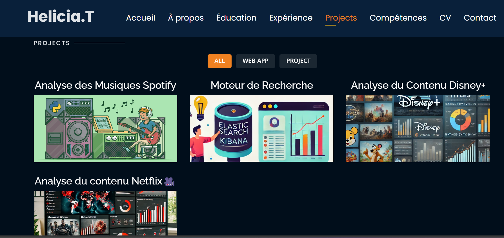

# Portfolio Personnel 🔥  

Je vous présente mon portfolio. Il a été cloné de [rajaprerak](https://github.com/rajaprerak/rajaprerak.github.io), modifié et adapté selon mes besoins.  

> [Lien vers le site](https://rajaprerak.github.io/)  

⭐️ **Ajoutez une étoile sur GitHub** — Cela aide beaucoup !  

---

## Aperçu du site web  
### Page d'accueil  
  

### Page "À propos"  
  

### Page "Projets"  
  

⭐️ **Ajoutez une étoile sur GitHub** — Cela aide beaucoup !  

---

## Fonctionnalités 📋  
- ⚡️ Complètement réactif  
- ⚡️ HTML5 et CSS3 valides  
- ⚡️ Animation de texte avec `Typed.js`  
- ⚡️ Facile à modifier  

---

## Installation et déploiement 📦  
1. Clonez le dépôt et modifiez le contenu du fichier **`index.html`**.  
2. Ajoutez ou supprimez des images dans le répertoire `assets/img/` selon vos besoins.  
3. Mettez à jour les informations du dossier `projects` en fonction de vos besoins.  
4. Utilisez [GitHub Pages](https://create-react-app.dev/docs/deployment/#github-pages) pour créer votre propre site web.  
5. Pour déployer votre site, créez un dépôt GitHub avec le nom `<votre-nom-d'utilisateur-GitHub>.github.io` et poussez le code généré dans la branche `master`.  

---

## Sections 📚  
✔️ À propos  
✔️ Intérêts  
✔️ Formation académique  
✔️ Certifications en ligne  
✔️ Expérience  
✔️ Projets  
✔️ Compétences  
✔️ CV  
✔️ Informations de contact  

---

## Outils utilisés 🛠️  
- **GitHub Pages** — Pour héberger mon site statique (HTML, CSS, JS).  

---

## Contribuer 💡  
### Étape 1  
- **Option 1**  
  🍴 Forkez ce dépôt !  

- **Option 2**  
  👯 Clonez ce dépôt sur votre machine locale.  

### Étape 2  
- **Développez votre code** 🔨🔨🔨  

### Étape 3  
- 🔃 Créez une nouvelle pull request.  

---

## Licence  
  

**[Licence MIT](http://opensource.org/licenses/mit-license.php)**  
